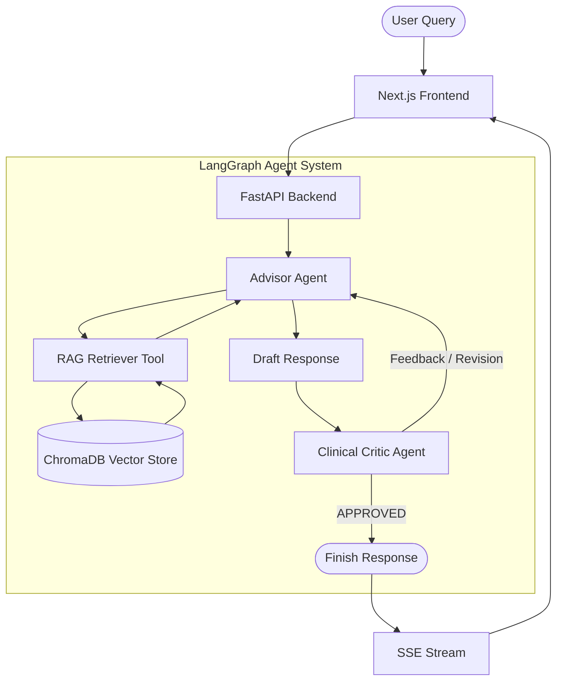

# OncoAgent: Oncology Research Assistant

OncoAgent is a state-of-the-art oncology research assistant built using a multi-agent **Advisor-Critic** architecture. It leverages a Retrieval-Augmented Generation (RAG) pipeline to query and synthesize insights from clinical reference documents, clinical trials, and oncology guidelines stored in a local vector database.

---

## Architecture Overview

The application is split into a Next.js frontend and a FastAPI backend orchestrating the agent workflows via LangGraph.



### Key Orchestration Flow:
1. **Advisor Agent**: Queries the local vector database using LlamaIndex and ChromaDB, draft a response, and strictly avoids hallucination by stating when no information is found.
2. **Clinical Critic Agent**: Reviews the draft response for clinical accuracy, proper markdown formatting, and guideline compliance. If accurate, it stamps `APPROVED`. Otherwise, it routes back to the Advisor with feedback for correction.

---

## Technology Stack

| Layer | Technologies |
| :--- | :--- |
| **Frontend** | Next.js (App Router), TypeScript, Vanilla CSS Modules |
| **Backend API** | FastAPI, Uvicorn, Pydantic |
| **Agent Framework** | LangGraph, LangChain |
| **RAG & Search** | LlamaIndex, PyMuPDF (fitz) |
| **Vector DB** | ChromaDB, OpenAI Embeddings (`text-embedding-3-small`) |
| **Evaluation** | Ragas (Faithfulness, Answer Relevancy, Context Precision) |
| **Package Management** | `uv` (Fast Python Package Installer), `npm` |

---

## Project Structure

```
├── backend/                  # FastAPI Application
│   ├── agents/               # Advisor and Critic agent definitions
│   │   ├── advisor.py
│   │   └── critic.py
│   ├── langraph/             # LangGraph state machine & router
│   │   └── agent_graph.py
│   ├── rag/                  # RAG parsing, chunking, and database setup
│   │   ├── chroma_db/        # SQLite persistent database storage
│   │   ├── files/            # Uploaded PDF and guideline documents
│   │   ├── chunker.py
│   │   ├── evaluate.py       # Ragas evaluation harness
│   │   ├── parser.py
│   │   ├── pipeline.py       # Document ingestion pipeline
│   │   └── vector_store.py
│   ├── tools/                # Agent tools (Chroma retriever)
│   │   └── rag_retriever.py
│   └── requirements.txt
├── frontend/                 # Next.js Frontend Application
│   ├── public/               # Static assets
│   ├── src/
│   │   └── app/              # Frontend pages and CSS modules
│   └── package.json
├── plans/                    # Feature plans and architectural blueprints
├── pyproject.toml            # Python project-level configuration
├── agents.md                 # Agent-specific coding instructions
└── skills.md                 # Project coding standards and rules
```

---

## Getting Started

### Prerequisites
- Python 3.12+ (managed natively via `uv`)
- Node.js 18+ & npm
- An OpenAI API Key (required for LLM & Embedding processing)

### Setup & Configuration

1. **Clone the repository and set up environment variables**:
   ```bash
   # Create and populate backend configuration
   copy .env.example .env
   copy backend/.env.example backend/.env

   # Create and populate frontend configuration
   copy frontend/.env.example frontend/.env.local
   ```
   *Make sure to paste your actual `OPENAI_API_KEY` inside `backend/.env`.*

2. **Backend Installation & Sync**:
   We use `uv` for python dependencies management. From the root of the project, run:
   ```bash
   uv sync
   ```
   This automatically creates a `.venv` with Python 3.12 and installs all required dependencies.

3. **Frontend Installation**:
   Navigate to the frontend directory and install Node.js packages:
   ```bash
   cd frontend
   npm install
   ```

---

## Running the Application

### 1. Start the FastAPI Backend
Start the FastAPI app using `uv` (either by navigating into the `backend/` directory or by setting the `PYTHONPATH` environment variable):

#### Option A: Run from the `backend/` directory (Recommended)
```bash
cd backend
uv run uvicorn main:app --host 127.0.0.1 --port 8000 --reload
```

#### Option B: Run from the root directory with `PYTHONPATH`
- **Windows (PowerShell)**:
  ```powershell
  $env:PYTHONPATH="backend"
  uv run uvicorn backend.main:app --host 127.0.0.1 --port 8000 --reload
  ```
- **Windows (CMD)**:
  ```cmd
  set PYTHONPATH=backend
  uv run uvicorn backend.main:app --host 127.0.0.1 --port 8000 --reload
  ```
- **Linux / macOS**:
  ```bash
  PYTHONPATH=backend uv run uvicorn backend.main:app --host 127.0.0.1 --port 8000 --reload
  ```

The API documentation will be available at `http://127.0.0.1:8000/docs`.

### 2. Start the Next.js Frontend
From the `frontend/` directory, run:
```bash
npm run dev
```
Open [http://localhost:3000](http://localhost:3000) in your browser.

### 3. Run Pipeline Evaluations
You can run a validation script to test and score your RAG setup using Ragas:
```bash
# Run Ragas evaluation
uv run python backend/rag/evaluate.py
```

---

## Development Guidelines

* **Max 70 Lines per Backend File**: Keep Python modules lean, single-purpose, and highly modular.
* **No Tailwind CSS**: Keep styling scoped using **Vanilla CSS Modules** (e.g., `Component.module.css`).
* **Environment Integrity**: Ensure any new secrets or configurable endpoints are referenced in `.env.example` templates.
